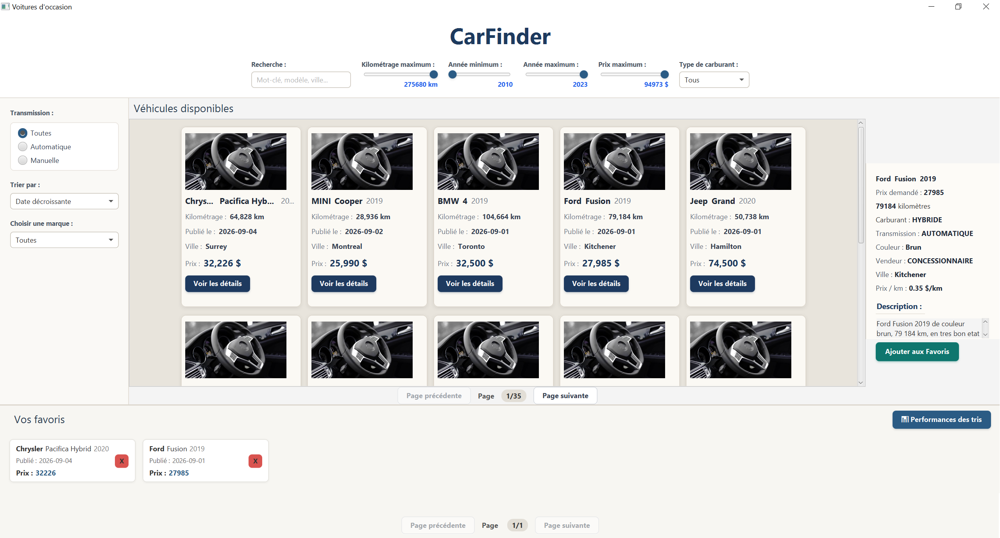
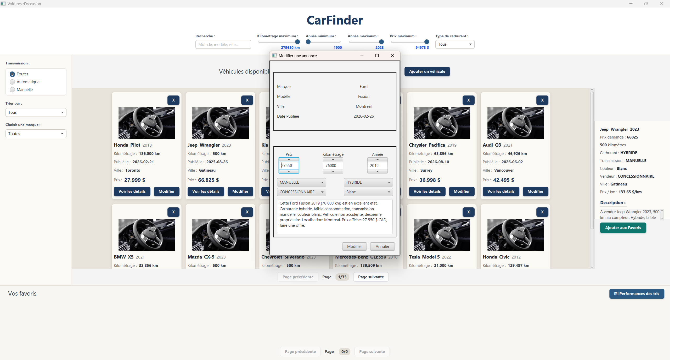
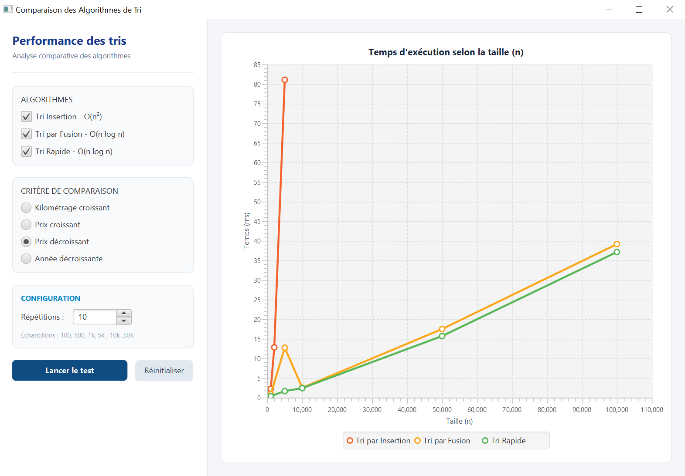

# LABORATOIRE 2 - 420-930-MA - Ete 2026 - gr. 25604

# Voitures d'occasion - Lab 3

**Cours** : 420-930-MA — Algorithmes et modèles de programmation
**Session** : Été 2026, groupe 25604
**Laboratoire** : 3 (Application JavaFX v1)
**Date de remise** : 20 septembre 2026, 23h59

---

## Équipe

| Nom complet           | Adresse courriel        | Contribution principale                               					|
| --------------------- | ----------------------- | ------------------------------------------------------------------------|
| Ammmour, Nadjib       | nadjib.ammour@gmail.com | connexion, interface DAO et implémentation PostgreSQL 					|
| Pierre, Jean-François | jfp112@hotmail.com      | schéma SQL, scripts de création et de peuplement      					|
| Chandel, Amit         | a.chandel@pm.me         | formulaires CRUD, validation, alertes 									|

---

## Sujet choisi

**Numéro du sujet** : 2
**Nom du sujet** : Voitures d'occasion

---

## 🔗 Lien du dépôt GitHub PUBLIC

**URL** : https://github.com/NjGuitlab/voitures-occasion-javafx

> ⚠️ Vérifier que le dépôt est **PUBLIC** et accessible sans authentification.
> Tester le lien dans un navigateur privé avant la remise.

---

## Fonctionnalités implémentées

### ✅ Obligatoires (cocher ce qui est fait)
- [x] connexion, interface DAO et implémentation PostgreSQL
- [x] schéma SQL, scripts de création et de peuplement
- [x] formulaires CRUD, validation, alertes
- [x] Architecture MVC avec packages séparés (model / service / algorithmes / controller / util)
- [x] Chargement des données depuis fichier CSV (nombre de lignes : 420)
- [x] Interface JavaFX principale avec liste/tableau
- [x] Panneau détail affichant l'élément sélectionné
- [x] Pagination fonctionnelle (taille de page : 12)
- [x] Filtres multi-critères combinables (nombre implémentés : 6 / 7)
- [x] Recherche par texte en temps réel
- [x] Interface Algorithme définie
- [x] Tri #1 implémenté : Insertion
- [x] Tri #2 implémenté : Rapide
- [x] Tri #3 implémenté : Fusion
- [x] Comparateur/benchmark des tris avec mesure du temps
- [x] Wishlist / Favoris (ajout, retrait, pas de doublons)
- [x] CSS appliqué (thème visuel du projet)


### ❌ Non implémenté (assumer honnêtement)

- ***

## Structure du projet

```

voitures-occasion-javafx/
├── pom.xml
├── src/main/
│   ├── java/
│   │   └── com.cours/
│   │       ├── Launcher.java
│   │       ├── MainFx.java
│   │       ├── dao
│   │       ├── model/
│   │       ├── service/
│   │       ├── algorithmes/
│   │       ├── controller/
│   │       └── util/
│   └── resources/
│       ├── images/
│       ├── fxml/
│       ├── css/
│       ├── data/
│       ├── donnees.sql
│       ├── schema.sql
│       └── database.properties.example
```

---

## Instructions pour lancer le projet

### Prérequis

- JDK 21
- Maven version 3.14.0
- (optionnel) IntelliJ IDEA / Eclipse

### Étapes

```bash  
# 1. Installer le moteur postgres https://www.postgresql.org/download/, configurer et démarrer le serveur.

# 2. Installer un outil de gestion postgres (ex: PGADMIN https://www.pgadmin.org/) et créer une base de données (PGADMIN).

# 3. Exécuter dans l'outil de gestion le SQL dans les fichiers schema.sql et donnees.sql pour créer les tables et les populer, respectivement.

# 4. Cloner le dépôt
git clone https://github.com/NjGuitlab/voitures-occasion-javafx.git

# 5. Renommer database.properties.example à database.properties et modifier les valeurs dans le fichier où demandé pour permettre de communiquer avec le serveur postgres.

# 6. cd dans voitures-occasion-javafx et exécuter mvn clean javafx:run pour lancer l'application

```

### Alternative dans IntelliJ

1. Ouvrir le projet dans IntelliJ (File > Open > dossier du projet)
2. Attendre que Maven télécharge les dépendances
3. Ouvrir `Launcher.java`
4. Cliquer sur le bouton Run

---

## Choix techniques

### Version Java utilisée

Java 21

### Format des données

CSV, séparateur: virgule, encodage : UTF-8, nombre de lignes : 420
PostgresSQL

### Algorithmes de tri implémentés

- Insertion : O(n²)
- Rapide : O(n log n)
- Fusion : O(n log n)

### Bibliothèques externes utilisées

- junit-jupiter

---

## Répartition du travail (auto-évaluation)

| Membre        | % contribution estimée | Ce sur quoi j'ai travaillé                               |
| ------------- | ---------------------- | ---------------------------------------------------------|
| Jean-François | 33%                    | schéma SQL, scripts de création et de peuplement  		|
| Nadjib        | 33 %                   | connexion, interface DAO et implémentation PostgreSQL 	|
| Amit          | 33%%                   | formulaires CRUD, validation, alertes         			|

---

## Captures d'écran

### Écran principal



### Example de modification



### Écran de benchmark




---

## Historique Git

**Nombre total de commits** : 133
**Date du premier commit** : 2026-08-26
**Date du dernier commit** : 2026-09-20

Voir l'onglet **Insights > Contributors** de GitHub pour voir la contribution de chacun.

---


